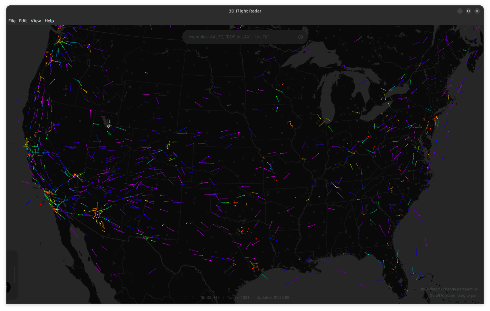
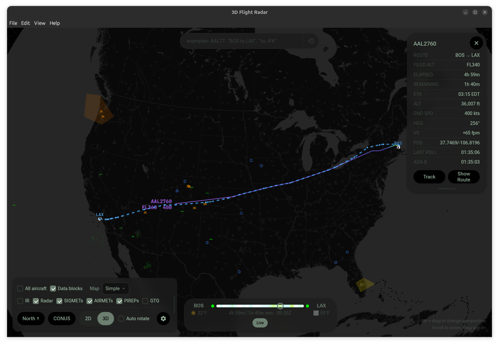
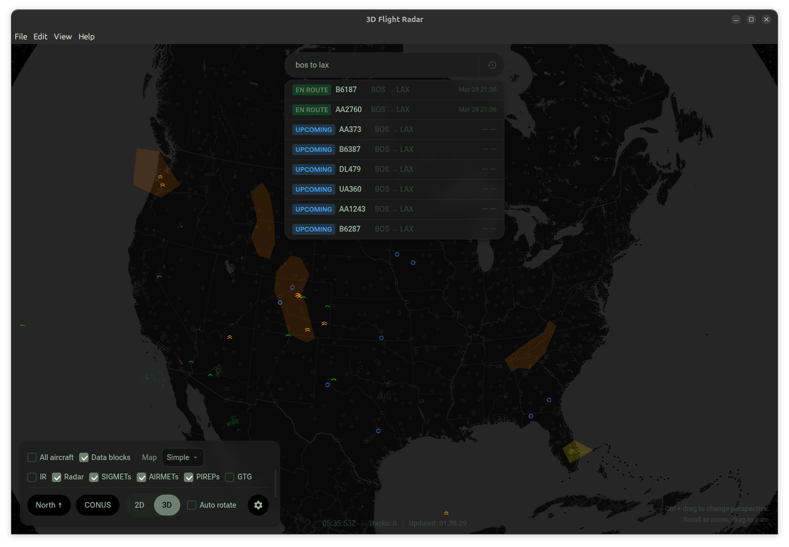
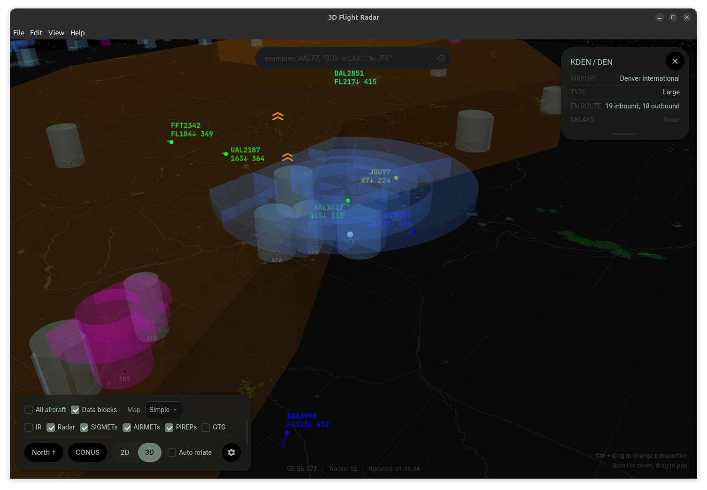
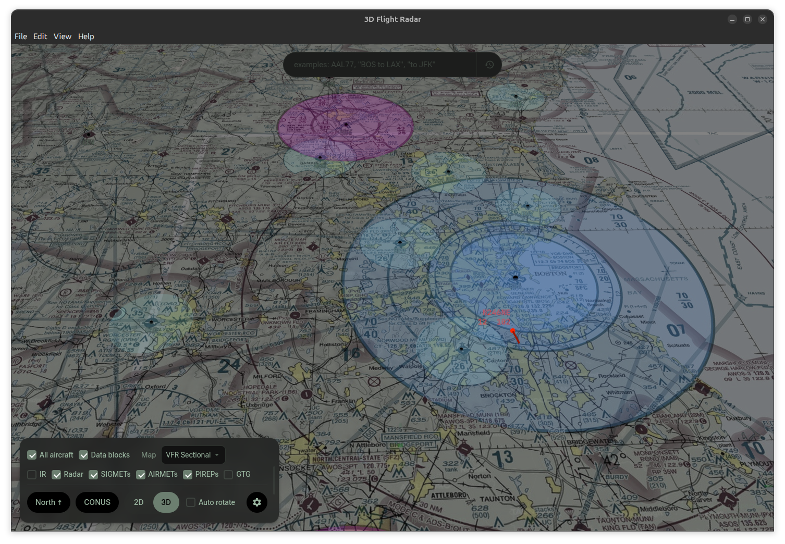

# Flight Radar 3D



Real-time 3D flight tracker built with Electron + CesiumJS.

## Quick Start

```bash
npm install      # copies CesiumJS runtime to vendor/, downloads fonts
npm run dev      # Vite dev server + Electron with HMR
npm run build    # production build → out/
npm start        # preview production build
```

## Architecture

**Electron main process** (`main.js`) owns all external API calls — OpenSky
Network (OAuth2), FlightAware AeroAPI, FAA AWC — avoiding CORS restrictions
and managing rate limiting centrally. It exposes results to the renderer via
a context-isolated IPC bridge (`preload.js`) as `window.flightAPI`.

**CesiumJS** renders the 3D/2D map. It is an npm devDependency; the
`postinstall` script copies `node_modules/cesium/Build/Cesium/` to `vendor/`
so it can be served as static files. No Cesium Ion token is required.

**Renderer modules** (`src/`) are ES modules bundled by Vite. Each module
exposes its API on `window` for cross-module access. Import order is defined in
`src/entry.js` — `radar-core.js` must be imported first, then the other
`radar-*.js` files in order, then `radar.js` last.

**`window.flightAPI`** is the API abstraction layer exposed by `preload.js`.
All renderer code calls only this interface for settings persistence and
external API access.

## Making Changes

### Adding a feature

Edit the appropriate module in `src/`. When adding a new feature, document it
in `src/help.html`.

### Adding a persisted setting

Update all three locations:

1. `DEFAULT_SETTINGS` in `src/defaults.js`
2. `CONFIG` defaults in `src/config.js`
3. `loadAndApplySettings()` in `src/radar.js` — load the value, sync the UI
   element, and save on change in the event handler

### Settings UI

All settings form HTML, CSS, and event wiring live in `src/settings.js`.
The Electron wrapper (`src/settings-electron.js`) provides only `onClose`,
`onDefaults`, and `onChanged` callbacks. Do not add settings markup or styling
in the wrapper.

### Versioning

Increment `version` in `package.json` on every change merged to `main`
(not on feature branches). Semantic versioning: major for breaking changes,
minor for new features, patch for bug fixes.

## APIs & Credentials

### OpenSky Network

Anonymous access works out of the box with lower rate limits. For higher
limits, create a free account at https://opensky-network.org and generate
OAuth2 client credentials. Enter them in Settings.

Rate limits enforced by the app:
- `/states/all`: 10-second minimum interval (default poll: 15s)
- `/tracks/all`: 10-second minimum interval

### FlightAware AeroAPI

Required for flight search and route display. Get a key at
https://www.flightaware.com/aeroapi/. Enter it in Settings.

## Packaging

### General

```bash
npm run pack     # build + unpacked directory → dist/win-unpacked/
npm run dist     # build + installer → dist/Flight Radar Setup *.exe
```

Uses **electron-builder** with NSIS (Windows `.exe`) and deb (Linux `.deb`)
targets configured in the `"build"` field of `package.json`.

### Snap (Linux)

`snap/snapcraft.yaml` supports automated Snap Store builds via Snapcraft's
GitHub integration. The build runs `scripts/obfuscate-snap.js` to minify and
obfuscate JS before packaging.

**Install from Snap Store:**

```bash
sudo snap install flight-radar
```

**Local snap build** (requires Snapcraft + LXD):

```bash
# One-time setup
sudo snap install snapcraft --classic
sudo snap install lxd && sudo lxd init --auto
sudo usermod -aG lxd $USER && newgrp lxd

# Build
snapcraft pack

# Install locally
sudo snap install flight-radar_*.snap --dangerous
```

## Project Structure

```
main.js                   # Electron main process (ESM, API calls, IPC, windows)
preload.js                # Context-isolated IPC bridge → window.flightAPI
settings-preload.js       # IPC bridge for settings window
electron.vite.config.mjs  # Vite config (main, preload, renderer builds)
src/
  entry.js                # Renderer entry — imports all modules + renderer.js
  index.html              # Electron renderer HTML (<script type="module">)
  renderer.js             # Electron renderer entry point
  settings-entry.js       # Settings window entry — imports defaults + settings
  settings.html           # Settings window HTML
  settings-electron.js    # Settings window logic (Electron IPC wrapper)
  settings.js             # Settings panel UI — HTML template, CSS, event wiring
  settings.css            # Settings window styling
  help.html               # In-app help documentation
  help.css                # Help window styling
  help-preload.js         # Help window preload
  defaults.js             # Default settings values
  config.js               # CONFIG object, color/theme utilities
  data.js                 # Airport DB, state vector parsing
  icons.js                # Canvas-based aircraft icon generation
  cloud.js                # PocketBase cloud sync + Google OAuth
  radar-core.js           # Cesium viewer init, theme engine (load first)
  radar-weather.js        # NEXRAD, GTG turbulence, PIREPs, SIGMETs, G-AIRMETs
  radar-markers.js        # Airport markers, airspace, waypoints, navaids
  radar-aircraft.js       # Aircraft entities, trails, polling loop
  radar-ui.js             # HUD, camera events, UI controls, 2D/3D morphing
  radar-flightplan.js     # Aircraft selection, FlightAware flight plan search
  radar-timeline.js       # Timeline scrubber for flight plan playback
  radar.js                # Init helpers (loaded last)
  styles.css              # All application CSS
out/                      # Build output (gitignored)
  main/index.js           # Bundled main process
  preload/                # Bundled preload scripts
  renderer/               # Bundled renderer (HTML, JS, CSS, static assets)
data/
  airports.json           # Airport database
  airspace.json           # Class B/C/D airspace boundaries
  waypoints.json          # Navigation fixes
vendor/                   # Third-party assets (gitignored, created by postinstall)
  cesium/                 # CesiumJS runtime
  fonts/                  # Bundled fonts (Roboto Flex, JetBrains Mono)
scripts/
  copy-cesium.js          # postinstall: copies CesiumJS build to vendor/
  check-fonts.js          # postinstall: verifies/downloads fonts to vendor/fonts/
  obfuscate-snap.js       # snap build: minifies/obfuscates JS before packaging
  generate-icon.js        # generates app icon assets
  download-airports.js    # data refresh scripts
  download-airspace.js
  download-waypoints.js
  promote-airports.js
  publish-snap.sh         # snap publishing helper
  snap-launcher.sh        # snap launcher wrapper
utils/
  fix-sandbox.sh          # sandbox fix utility
site/                     # Static marketing/help site
  screenshots/            # App screenshots used in README and marketing
```

## Screenshots

 

 
